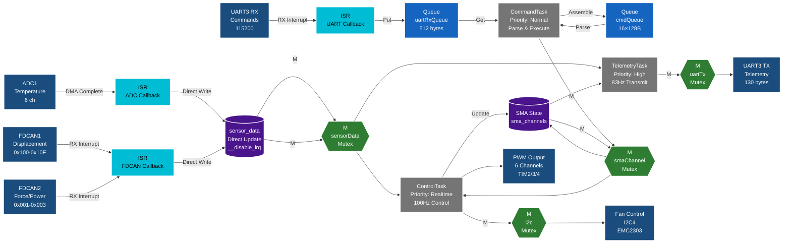

# WR_embedded RTOS 아키텍처 문서

## 목차
1. [개요](#개요)
2. [RTOS 구성](#rtos-구성)
3. [태스크 구조](#태스크-구조)
4. [동기화 객체](#동기화-객체)
5. [태스크 간 통신](#태스크-간-통신)
6. [인터럽트 처리](#인터럽트-처리)
7. [시스템 초기화](#시스템-초기화)
8. [하드웨어 매핑](#하드웨어-매핑)
9. [데이터 흐름](#데이터-흐름)

---

## 개요

본 시스템은 **FreeRTOS Kernel V10.3.1**을 기반으로 하는 6채널 소프트 로봇 웨어러블 제어 시스템입니다. STM32H7 마이크로컨트롤러에서 실행되며, 정밀한 실시간 제어와 센서 데이터 수집, 원격 통신 기능을 제공합니다.

### 주요 특징
- **실시간 제어**: 100Hz (10ms 주기) 정밀 제어 루프
- **멀티태스킹**: 4개의 RTOS 태스크로 기능 분리
- **센서 통합**: CAN 버스, ADC, UART를 통한 다중 센서 데이터 수집
- **안전한 동기화**: 뮤텍스 기반 공유 리소스 보호

---

## RTOS 구성

### FreeRTOS 설정 요약
**설정 파일**: `Core/Inc/FreeRTOSConfig.h`

| 설정 항목 | 값 | 설명 |
|---------|-----|------|
| **선점형 스케줄링** | Enabled | 우선순위 기반 태스크 전환 |
| **최대 우선순위** | 56 | 0 (가장 낮음) ~ 56 (가장 높음) |
| **틱 주파수** | 1000 Hz | 1ms 타이머 틱 |
| **힙 크기** | 65536 bytes (64KB) | 동적 메모리 할당 영역 |
| **API 버전** | CMSIS-RTOS V2 | ARM 표준 RTOS API |
| **스택 오버플로 체크** | Mode 2 | 런타임 스택 오버플로 감지 |

### 활성화된 기능
- ✅ 뮤텍스 (재귀 뮤텍스 포함)
- ✅ 카운팅 세마포어
- ✅ 소프트웨어 타이머
- ✅ 큐(메시지 큐)
- ✅ 트레이스 기능
- ✅ 정적/동적 메모리 할당

---

## 태스크 구조

### 태스크 개요
**정의 위치**: `Core/Src/freertos.c`

| 태스크 이름 | 우선순위 | 스택 크기 | 주기/트리거 | 주요 기능 |
|------------|---------|----------|-----------|----------|
| **ControlTask** | Realtime (56) | 4096 bytes | 10ms | SMA 액추에이터 제어 및 센서 업데이트 |
| **TelemetryTask** | High (40) | 2048 bytes | 12ms | 원격 측정 데이터 전송 |
| **CommandTask** | Normal (24) | 2048 bytes | Event-driven | UART 명령 수신 및 실행 |
| **NRF70_Task** | Normal1 (25) | 1024 bytes | 1ms | WiFi 모듈 테스트 (현재 비활성) |

### 우선순위 계층 구조
```
┌─────────────────────────────────────┐
│ Highest Priority (56)               │
│   ▶ ControlTask (Realtime)         │  ← 실시간 제어 루프 (10ms 정밀도)
├─────────────────────────────────────┤
│ High Priority (40)                  │
│   ▶ TelemetryTask (High)           │  ← 고속 원격 측정 (12ms)
├─────────────────────────────────────┤
│ Normal Priority (24-25)             │
│   ▶ NRF70_Task (25)                │
│   ▶ CommandTask (24)               │  ← 명령 처리
├─────────────────────────────────────┤
│ Lowest Priority                     │
│   ▶ Timer Service Task (2)         │
│   ▶ Idle Task (0)                  │
└─────────────────────────────────────┘
```

---

## 태스크 상세 설명

### 1. ControlTask (실시간 제어)
**파일**: `Core/Src/freertos.c:286-339`

**목적**: 시스템의 핵심 제어 루프로, 정확히 10ms 주기로 SMA 액추에이터를 업데이트하고 PID 제어를 수행합니다.

**동작 흐름**:
```c
초기화: xLastWakeTime = xTaskGetTickCount();

무한 루프:
  1. vTaskDelayUntil(&xLastWakeTime, 10ms)  // 정밀 주기 대기
  2. LED 토글 (디버깅용)
  3. [sensorDataMutex 획득]
     - 센서 데이터 읽기 (현재는 비활성화)
  4. [smaChannelMutex 획득]
     - SMA_Update() 호출 → PWM 출력 업데이트
  5. 100ms마다 (10번 반복마다):
     [i2cMutex 획득]
     - SMA_UpdateFans() 호출 → I2C로 팬 속도 제어
```

**주요 함수**:
- `SMA_Update()`: 각 채널의 PID 제어기 실행 및 PWM 출력
- `SMA_UpdateFans()`: EMC2303 팬 컨트롤러 업데이트

**타이밍 정확도**: `vTaskDelayUntil()` 사용으로 누적 오차 없이 정확히 10ms 주기 유지

---

### 2. TelemetryTask (원격 측정)
**파일**: `Core/Src/freertos.c:348-368`

**목적**: 주기적으로 시스템 상태 데이터를 UART를 통해 호스트로 전송합니다.

**동작 흐름**:
```c
초기화: xLastWakeTime = xTaskGetTickCount();

무한 루프:
  1. vTaskDelayUntil(&xLastWakeTime, 12ms)  // ~83Hz
  2. Comm_SendTelemetry_Safe() 호출
     → 내부적으로 uartTxMutex 획득 후 전송
```

**전송 데이터 프레임** (130 bytes):
- 헤더: `0xAA 0x55` (2 bytes)
- 타임스탬프 (4 bytes)
- 6채널 SMA 상태 (6 × 20 bytes = 120 bytes)
  - 각 채널: 온도, PWM, 전류, 변위, 힘, 제어 모드 등
- CAN 메시지 카운터 (4 bytes)
- 체크섬 (미구현)

**전송 속도**: ~83Hz (12ms 주기)

#### 텔레메트리 타이밍 설계 배경

**왜 12ms (83Hz)인가?**

원래 목표는 **80Hz**였으며, 이는 외부 HX711 로드셀의 하드웨어 제약에서 비롯되었습니다:

1. **HX711 로드셀 ADC 제약**:
   ```
   HX711 최대 샘플링 레이트: 80 SPS (Samples Per Second)
   → 텔레메트리도 80Hz로 동기화
   → 외부 센서 데이터와 SMA 제어 데이터를 하나의 프레임으로 전송
   ```

2. **FreeRTOS 틱 제약**:
   ```
   80Hz = 12.5ms 주기
   하지만 FreeRTOS 틱은 1ms 단위 (정수만 가능)
   → 12ms 또는 13ms 중 선택
   → 더 빠른 12ms 선택 (83.33Hz ≈ 80Hz, 오차 4%)
   ```

3. **UART 대역폭 고려**:
   ```
   프레임 크기: 130 bytes
   UART 속도: 115200 baud
   전송 시간: 130 × 10 ÷ 115200 = 11.3ms

   100Hz (10ms): 대역폭 113% 사용 (오버플로우 위험)
   83Hz (12ms): 대역폭 94% 사용 (안전)
   80Hz (12.5ms): 대역폭 90% 사용 (이상적)
   ```

**현재 상태**: FDCAN으로 전환했지만 레거시 80Hz 설계를 유지하여 향후 HX711 통합 가능성을 열어둠.

---

### 3. CommandTask (명령 처리)
**파일**: `Core/Src/freertos.c:235-277`

**목적**: UART로 수신한 명령을 파싱하고 실행합니다. 이벤트 기반으로 동작합니다.

**동작 흐름**:
```c
무한 루프:
  1. uartRxQueue에서 1바이트 수신 (대기)
     → ProcessReceivedByte(byte) 호출
     → 완전한 명령 라인 조립 (CR/LF 감지)
     → cmdQueue에 명령 라인 전송

  2. cmdQueue에서 명령 문자열 읽기 (논블로킹)
     → Comm_ParseCommand() 호출 (파싱)
     → Comm_ExecuteCommand() 호출 (실행)
     → Comm_SendResponse("OK\r\n") 전송
```

**지원 명령어 예시**:
- `MODE <ch> <mode>`: 제어 모드 설정 (0=OPEN, 1=TEMP, 2=FORCE)
- `PWM <ch> <value>`: PWM 듀티 직접 설정
- `TEMP <ch> <temp>`: 목표 온도 설정
- `PID <ch> <P> <I> <D>`: PID 게인 설정
- `FAN <fan_id> <rpm>`: 팬 속도 설정
- `STOP`: 모든 채널 정지

**큐 크기**:
- `uartRxQueue`: 512 bytes (바이트 버퍼)
- `cmdQueue`: 16 × 128 bytes (명령 문자열 버퍼)

---

### 4. NRF70_Task (WiFi 모듈)
**파일**: `Core/Src/freertos.c:377-386`

**상태**: Placeholder (현재 비활성)
**목적**: nRF7002 WiFi 모듈 테스트용 태스크

---

## 동기화 객체

### 뮤텍스 (Mutexes)
**생성 위치**: `Core/Src/freertos.c:165-226`

| 뮤텍스 이름 | 보호 대상 | 사용 태스크 | 타임아웃 |
|-----------|---------|----------|---------|
| **sensorDataMutex** | 센서 데이터 구조체 (`sensor_data`) | ControlTask, ISR | 5ms |
| **smaChannelMutex** | SMA 채널 상태 (`sma_channels`) | ControlTask, CommandTask | 5ms |
| **uartTxMutex** | UART 송신 버퍼 | TelemetryTask, CommandTask | 50ms |
| **i2cMutex** | I2C 버스 (EMC2303 팬 제어) | ControlTask | 5ms |

**사용 패턴**:
```c
if (osMutexAcquire(smaChannelMutexHandle, 5) == osOK) {
    // 임계 영역: SMA 데이터 접근
    SMA_Update();
    osMutexRelease(smaChannelMutexHandle);
}
```

### 메시지 큐 (Message Queues)

| 큐 이름 | 크기 | 아이템 크기 | 목적 |
|--------|------|-----------|------|
| **uartRxQueue** | 512 items | 1 byte | ISR → CommandTask 바이트 전달 |
| **cmdQueue** | 16 items | 128 bytes | CommandTask 내부 명령 라인 버퍼 |

**데이터 흐름**:
```
UART RX ISR → uartRxQueue (1 byte) → CommandTask
                                      ↓
                              조립된 명령 라인
                                      ↓
                                   cmdQueue (128 bytes)
                                      ↓
                              파싱 및 실행
```

---

## 태스크 간 통신

### 1. ISR → Task (인터럽트 → 태스크)

#### UART 수신
```
HAL_UART_RxCpltCallback (ISR)
         ↓
  RTOS_UART_RxCallback()
         ↓
  osMessageQueuePut(uartRxQueue, &byte, 0)  [논블로킹]
         ↓
  CommandTask: osMessageQueueGet()
```

#### CAN 수신
```
HAL_FDCAN_RxFifo0Callback (ISR)
         ↓
  RTOS_FDCAN_RxCallback()
         ↓
  Sensor_UpdateCAN()  [직접 업데이트, 큐 없음]
         ↓
  sensor_data 구조체 업데이트 (인터럽트 비활성화로 보호)
```

#### ADC 변환 완료
```
HAL_ADC_ConvCpltCallback (ISR)
         ↓
  RTOS_ADC_ConvCpltCallback()
         ↓
  Sensor_UpdateADC()  [직접 업데이트]
         ↓
  sensor_data.temperature[] 업데이트
```

### 2. Task → Task (태스크 간)

**공유 데이터 방식** (뮤텍스 보호):
- CommandTask → ControlTask: SMA 설정 변경 (`smaChannelMutex`)
- ControlTask → TelemetryTask: 센서 데이터 읽기 (`sensorDataMutex`)

**함수 호출 방식**:
- `SMA_SetMode()`, `SMA_SetTargetTemp()`, `SMA_SetPWM()`
- 내부적으로 뮤텍스 획득 후 상태 변경

---

## 인터럽트 처리

### ISR 안전 규칙

1. **논블로킹 작업만 허용**:
   - `osMessageQueuePut(..., timeout=0)` 사용
   - 뮤텍스 사용 금지 (데드락 위험)

2. **센서 업데이트 보호**:
```c
// sensors.c
void Sensor_UpdateCAN(...) {
    __disable_irq();  // 인터럽트 비활성화
    // sensor_data 업데이트
    __enable_irq();   // 인터럽트 재활성화
}
```

3. **우선순위**:
   - UART: 중간 우선순위
   - FDCAN: 높은 우선순위 (실시간 센서)
   - ADC/DMA: 높은 우선순위

### 활성 인터럽트

| 인터럽트 | 소스 | 핸들러 | RTOS 콜백 |
|---------|------|--------|----------|
| USART3 RX | UART 수신 | `HAL_UART_RxCpltCallback` | `RTOS_UART_RxCallback` |
| FDCAN1 RX | 변위 센서 (0x100-0x10F) | `HAL_FDCAN_RxFifo0Callback` | `RTOS_FDCAN_RxCallback` |
| FDCAN2 RX | 힘/전력 센서 (0x001-0x003) | `HAL_FDCAN_RxFifo0Callback` | `RTOS_FDCAN_RxCallback` |
| ADC1 + DMA2 | 온도 센서 (6채널) | `HAL_ADC_ConvCpltCallback` | `RTOS_ADC_ConvCpltCallback` |

---

## 시스템 초기화

### 초기화 시퀀스
**파일**: `Core/Src/main.c:main()`

```
1. 하드웨어 초기화 (HAL)
   ├─ MPU_Config()           // 메모리 보호 유닛
   ├─ HAL_Init()             // HAL 라이브러리
   ├─ SystemClock_Config()   // 480MHz 시스템 클럭
   ├─ MX_GPIO_Init()         // GPIO 핀
   ├─ MX_DMA_Init()          // DMA 컨트롤러
   ├─ MX_ADC1_Init()         // ADC1 (6채널)
   ├─ MX_FDCAN1_Init()       // CAN1 (1Mbps/2Mbps FD)
   ├─ MX_FDCAN2_Init()       // CAN2
   ├─ MX_I2C4_Init()         // I2C4 (EMC2303)
   ├─ MX_TIM2_Init()         // PWM 타이머 2
   ├─ MX_TIM3_Init()         // PWM 타이머 3
   ├─ MX_TIM4_Init()         // PWM 타이머 4
   └─ MX_USART3_UART_Init()  // UART3 (115200)

2. 모듈 초기화
   ├─ Sensor_Init()          // 센서 데이터 구조체 초기화
   ├─ FDCAN_Init()           // CAN 필터 설정
   ├─ HAL_ADC_Start_DMA()    // ADC DMA 시작
   ├─ Fans6_Init()           // EMC2303 팬 컨트롤러
   ├─ SMA_Init(10)           // SMA 제어기 (10ms 주기)
   ├─ Comm_Init(&huart3)     // 통신 프로토콜
   └─ HAL_UART_Receive_IT()  // UART 인터럽트 수신 시작

3. 채널 구성 (CH4, CH5 활성화)
   ├─ SMA_SetMode(CH4, TEMP_CONTROL)
   ├─ SMA_SetMode(CH5, FORCE_CONTROL)
   ├─ SMA_SetTargetTemp()    // 목표 온도 설정
   └─ SMA_SetPIDGains()      // PID 게인 설정

4. RTOS 시작
   ├─ osKernelInitialize()   // FreeRTOS 커널 초기화
   ├─ MX_FREERTOS_Init()     // 태스크/큐/뮤텍스 생성
   └─ osKernelStart()        // 스케줄러 시작 (반환 안됨)
```

### FreeRTOS 객체 생성 순서
**파일**: `Core/Src/freertos.c:MX_FREERTOS_Init()`

```c
1. 뮤텍스 생성
   - sensorDataMutexHandle
   - smaChannelMutexHandle
   - uartTxMutexHandle
   - i2cMutexHandle

2. 큐 생성
   - uartRxQueueHandle (512 × 1B)
   - cmdQueueHandle (16 × 128B)

3. 태스크 생성
   - CommandTaskHandle
   - ControlTaskHandle
   - TelemetryTaskHandle
   - NRF70_TaskHandle
```

---

## 하드웨어 매핑

### 센서 입력

| 센서 타입 | 인터페이스 | 채널/ID | 데이터 |
|----------|----------|--------|--------|
| **온도 센서** | ADC1 (DMA) | IN0-IN5 (6ch) | TMP235 아날로그 온도 |
| **변위 센서** | FDCAN1 | CAN ID 0x100-0x10F | 16채널 변위 (mm) |
| **힘 센서** | FDCAN2 | CAN ID 0x001 | 힘 데이터 (N) |
| **전력 센서** | FDCAN2 | CAN ID 0x002, 0x003 | 전압/전류/전력 |

### 액추에이터 출력

| 액추에이터 | 인터페이스 | 핀 | 설명 |
|----------|----------|-----|------|
| **SMA CH0** | TIM2_CH1 PWM | PA0 | Forearm L |
| **SMA CH1** | TIM2_CH2 PWM | PA1 | Forearm R |
| **SMA CH2** | TIM3_CH1 PWM | PA6 | Biceps L |
| **SMA CH3** | TIM3_CH2 PWM | PA7 | Biceps R |
| **SMA CH4** | TIM4_CH1 PWM | PB6 | Waist L ✅ |
| **SMA CH5** | TIM4_CH2 PWM | PB7 | Waist R ✅ |
| **Fan 1** | I2C4 (0x2E) | EMC2303 | SMA 냉각 팬 1 |
| **Fan 2** | I2C4 (0x2C) | EMC2303 | SMA 냉각 팬 2 |

### 통신 인터페이스

| 인터페이스 | 설정 | 용도 |
|----------|------|------|
| **UART3** | 115200 8N1 | 명령 수신 / 원격 측정 송신 |
| **FDCAN1** | 1Mbps/2Mbps FD | 변위 센서 네트워크 |
| **FDCAN2** | 1Mbps/2Mbps FD | 힘/전력 센서 네트워크 |
| **I2C4** | 400kHz Fast | EMC2303 팬 컨트롤러 |

---

## 시스템 블록 다이어그램

### 전체 데이터 흐름 아키텍처



### 다이어그램 설명

#### 레이어 구조
1. **입력 레이어** (왼쪽 상단):
   - ADC1: 6채널 온도 센서 (DMA 기반)
   - FDCAN1: 변위 센서 네트워크 (16개 ID)
   - FDCAN2: 힘/전력 센서 (3개 ID)
   - UART3 RX: 명령 인터페이스

2. **ISR 레이어** (중간 상단):
   - 하드웨어 인터럽트 핸들러
   - ISR-safe 작업만 수행 (논블로킹)

3. **버퍼/데이터 레이어** (중간):
   - 센서 데이터: 직접 업데이트 (인터럽트 비활성화 보호)
   - UART/Command 큐: RTOS 메시지 큐

4. **태스크 레이어** (중간 하단):
   - CommandTask: 명령 파싱 및 실행
   - ControlTask: 100Hz 제어 루프 (최고 우선순위)
   - TelemetryTask: 83Hz 원격 측정 전송

5. **동기화 레이어** (중간):
   - M: 뮤텍스 (Mutex) - 공유 리소스 보호
   - 4개 뮤텍스로 경합 조건 방지

6. **출력 레이어** (오른쪽):
   - PWM: 6채널 SMA 액추에이터
   - I2C: 팬 제어 (EMC2303)
   - UART TX: 텔레메트리 스트림

#### 주요 데이터 경로

**센서 → 제어 경로** (실시간):
```
ADC/CAN → ISR → sensor_data → [M_SENSOR] → ControlTask → SMA → PWM
```

**명령 처리 경로** (이벤트 기반):
```
UART RX → ISR → uartRxQueue → CommandTask → cmdQueue → [M_SMA] → sma_channels
```

**원격 측정 경로** (주기적):
```
sensor_data + sma_channels → [M_SENSOR, M_UART] → TelemetryTask → UART TX
```

#### 설계 특징

1. **Zero-Copy for Sensors**: 센서 데이터는 큐를 거치지 않고 직접 업데이트 (지연 최소화)
2. **Priority-based Scheduling**: ControlTask가 최고 우선순위로 10ms 정밀도 보장
3. **Mutex Protection**: 4개 뮤텍스로 공유 리소스 안전하게 보호
4. **ISR-safe Design**: ISR에서는 논블로킹 작업만 수행
5. **Layered Architecture**: 명확한 계층 분리로 유지보수성 향상

---

## 데이터 흐름

### 센서 데이터 수집 흐름

```
┌─────────────────────────────────────────────────────────┐
│                    센서 입력                             │
├──────────────┬──────────────┬──────────────────────────┤
│  ADC1 (Temp) │ FDCAN1 (Disp)│ FDCAN2 (Force/Power)    │
│   6 ch DMA   │   16 ch CAN  │      3 CAN IDs          │
└──────┬───────┴──────┬───────┴──────────┬───────────────┘
       │              │                  │
       └──────────────┴──────────────────┘
                      │
              [하드웨어 인터럽트]
                      ↓
       ┌──────────────────────────────┐
       │ HAL Callback (ISR Context)   │
       │  - FDCAN_RxFifo0Callback     │
       │  - ADC_ConvCpltCallback      │
       └──────────┬───────────────────┘
                  │
                  ↓
       ┌──────────────────────────────┐
       │ RTOS Callback (ISR-safe)     │
       │  - Sensor_UpdateCAN()        │
       │  - Sensor_UpdateADC()        │
       │  [__disable_irq() 보호]      │
       └──────────┬───────────────────┘
                  │
                  ↓
       ┌──────────────────────────────┐
       │ sensor_data (전역 구조체)     │
       │  - temperature[6]            │
       │  - displacement[16]          │
       │  - force_data                │
       │  - power_data                │
       └──────────┬───────────────────┘
                  │
                  ↓
       ┌──────────────────────────────┐
       │ ControlTask (10ms)           │
       │ [sensorDataMutex 획득]       │
       │  - 센서 데이터 읽기           │
       │  - PID 계산                  │
       │  - PWM 출력 결정             │
       └──────────┬───────────────────┘
                  │
                  ↓
       ┌──────────────────────────────┐
       │ 액추에이터 출력               │
       │  - PWM → SMA (6채널)         │
       │  - I2C → Fans (2개)          │
       └──────────────────────────────┘
```

### 명령 처리 흐름

```
┌─────────────────────────────────────────────────┐
│ UART3 수신 인터럽트 (1 byte)                     │
└────────────────┬────────────────────────────────┘
                 │
                 ↓ osMessageQueuePut()
┌─────────────────────────────────────────────────┐
│ uartRxQueue (512 bytes)                         │
└────────────────┬────────────────────────────────┘
                 │
                 ↓ osMessageQueueGet()
┌─────────────────────────────────────────────────┐
│ CommandTask: ProcessReceivedByte()             │
│  - 바이트 조립                                   │
│  - CR/LF 감지 시 완전한 명령 라인 전송           │
└────────────────┬────────────────────────────────┘
                 │
                 ↓ osMessageQueuePut()
┌─────────────────────────────────────────────────┐
│ cmdQueue (16 × 128 bytes)                       │
└────────────────┬────────────────────────────────┘
                 │
                 ↓ osMessageQueueGet()
┌─────────────────────────────────────────────────┐
│ CommandTask: 파싱 및 실행                        │
│  - Comm_ParseCommand()                          │
│    → 명령어와 인자 분리                          │
│  - Comm_ExecuteCommand()                        │
│    → SMA_SetMode(), SMA_SetPWM() 등 호출        │
│  - Comm_SendResponse("OK\r\n")                  │
└────────────────┬────────────────────────────────┘
                 │
                 ↓
┌─────────────────────────────────────────────────┐
│ 대상 모듈 상태 변경                              │
│  [smaChannelMutex 획득]                         │
│  - sma_channels[] 구조체 업데이트                │
│  - ControlTask가 다음 주기에 반영                │
└─────────────────────────────────────────────────┘
```

### 원격 측정 송신 흐름

```
┌─────────────────────────────────────────────────┐
│ TelemetryTask (12ms 주기)                        │
│  vTaskDelayUntil(12ms)                          │
└────────────────┬────────────────────────────────┘
                 │
                 ↓
┌─────────────────────────────────────────────────┐
│ Comm_SendTelemetry_Safe()                       │
│  [uartTxMutex 획득, timeout=50ms]               │
│  - 6채널 SMA 상태 수집                           │
│  - 센서 데이터 수집 [sensorDataMutex]            │
│  - 130바이트 바이너리 프레임 생성                 │
└────────────────┬────────────────────────────────┘
                 │
                 ↓
┌─────────────────────────────────────────────────┐
│ 프레임 구조 (130 bytes)                          │
│  - Header: 0xAA 0x55 (2B)                       │
│  - Timestamp: tick count (4B)                   │
│  - CH0 data (20B)                               │
│  - CH1 data (20B)                               │
│  - CH2 data (20B)                               │
│  - CH3 data (20B)                               │
│  - CH4 data (20B)                               │
│  - CH5 data (20B)                               │
│  - CAN counters (4B)                            │
└────────────────┬────────────────────────────────┘
                 │
                 ↓ HAL_UART_Transmit()
┌─────────────────────────────────────────────────┐
│ UART3 송신 (115200 baud)                        │
│  → 호스트 PC / 모니터링 시스템                   │
└─────────────────────────────────────────────────┘
```

---

## 타이밍 다이어그램

### 10ms 제어 주기 (ControlTask)

```
시간축 (ms):  0     10    20    30    40    50    60    70    80    90   100
              │     │     │     │     │     │     │     │     │     │     │
ControlTask:  ●─────●─────●─────●─────●─────●─────●─────●─────●─────●─────●
              │     │     │     │     │     │     │     │     │     │     │
              └─SMA─┘     └─SMA─┘     └─SMA─┘     └─SMA─┘     └─SMA─┘
              Update     Update     Update     Update     Update

팬 업데이트:  ●───────────────────────────────────────────────────────────────●
              (매 100ms = 10번의 ControlTask 주기마다)
```

### 태스크 실행 예시 (시간 슬라이스)

```
시간 (ms): 0    5    10   15   20   25   30   35   40   45   50
           │    │    │    │    │    │    │    │    │    │    │
Control    ████─────████─────████─────████─────████─────████  (10ms 주기, 최고 우선순위)
Telemetry  ──███──────███──────███──────███──────███─────███  (12ms 주기, 높은 우선순위)
Command    ───█───────────█───────██──────────█─────────────  (이벤트 기반, 보통 우선순위)
Idle       ────██████───█████──█──████████──███──████████───  (남은 시간)

범례: █ = 실행 중, ─ = 대기/슬립
```

---

## 주요 파일 참조

### 핵심 파일

| 컴포넌트 | 헤더 | 구현 |
|---------|------|------|
| **FreeRTOS 설정** | `Core/Inc/FreeRTOSConfig.h` | - |
| **태스크 정의** | - | `Core/Src/freertos.c` |
| **SMA 제어** | `Core/Inc/sma_actuator.h` | `Core/Src/sma_actuator.c` |
| **센서 관리** | `Core/Inc/sensors.h` | `Core/Src/sensors.c` |
| **통신 프로토콜** | `Core/Inc/comm_protocol.h` | `Core/Src/comm_protocol.c` |
| **CAN 버스** | `Core/Inc/fdcan.h` | `Core/Src/fdcan.c` |
| **팬 제어** | `Core/Inc/emc2303.h` | `Core/Src/emc2303.c` |
| **메인 초기화** | `Core/Inc/main.h` | `Core/Src/main.c` |

### FreeRTOS 커널
- 위치: `Middlewares/Third_Party/FreeRTOS/Source/`
- 버전: FreeRTOS Kernel V10.3.1
- CMSIS-RTOS V2 래퍼: `Middlewares/Third_Party/FreeRTOS/Source/CMSIS_RTOS_V2/`

---

## 시스템 성능 지표

### 타이밍 특성
| 항목 | 값 |
|------|-----|
| **제어 루프 주기** | 10ms (100Hz) |
| **제어 지터** | < 100μs (vTaskDelayUntil 사용) |
| **원격 측정 주기** | 12ms (~83Hz) |
| **명령 응답 시간** | < 5ms (평균) |
| **CAN 수신 지연** | < 1ms (ISR 우선순위) |

### 메모리 사용량
| 항목 | 크기 |
|------|------|
| **총 힙 크기** | 64KB (FreeRTOS) |
| **태스크 스택 합계** | 9KB (4개 태스크) |
| **큐 메모리** | 2.5KB (uartRxQueue + cmdQueue) |
| **센서 데이터** | ~1KB (전역 구조체) |

### CPU 부하 추정
- **ControlTask**: ~30% (10ms 중 ~3ms 실행)
- **TelemetryTask**: ~10% (12ms 중 ~1.2ms 실행)
- **CommandTask**: < 5% (이벤트 기반)
- **Idle Time**: ~55%

---

## 안전성 및 에러 처리

### 스택 오버플로 감지
- **활성화**: FreeRTOSConfig.h에서 Mode 2 설정
- **동작**: 컨텍스트 스위칭 시마다 스택 끝 패턴 검사
- **콜백**: `vApplicationStackOverflowHook()` 호출 (무한 루프)

### 뮤텍스 타임아웃
- **ControlTask**: 5ms 타임아웃 (실시간 보장)
- **TelemetryTask**: 50ms 타임아웃 (UART TX)
- **실패 처리**: 타임아웃 시 작업 건너뛰기 (다음 주기에 재시도)

### CAN 버스 에러
- **카운터**: `can1_msg_count`, `can2_msg_count` 추적
- **감지**: 원격 측정에 카운터 포함 (증가 모니터링)

### 온도 보호
- **오버히트 감지**: SMA 채널별 최대 온도 모니터링
- **팬 제어**: 온도 기반 자동 팬 속도 조절
- **긴급 정지**: `STOP` 명령으로 모든 PWM 비활성화

---

## 확장 가능성

### 추가 가능한 기능
1. **WiFi 통신**: NRF70_Task 활성화 (nRF7002 DK 통합)
2. **SD 카드 로깅**: 센서 데이터 로컬 저장
3. **추가 센서**: ADC 여유 채널 활용 (IN6-IN19)
4. **제어 알고리즘**: 고급 PID, 적응 제어, 머신러닝 통합
5. **다중 디바이스**: CAN 네트워크 확장

### 우선순위 최적화 고려사항
- ControlTask를 더 높은 인터럽트 우선순위로 이동 (ISR 지연 최소화)
- TelemetryTask 주기를 가변적으로 조정 (데이터 중요도 기반)
- 배터리 전원 시 Idle Task에서 저전력 모드 진입

---

## 결론

본 시스템은 FreeRTOS를 기반으로 하는 견고한 실시간 제어 아키텍처로, 다음과 같은 특징을 가집니다:

✅ **실시간성**: 10ms 정밀 제어 루프, 우선순위 기반 스케줄링
✅ **안전성**: 뮤텍스 기반 동기화, 스택 오버플로 감지
✅ **확장성**: 모듈화된 구조, 추가 센서/액추에이터 통합 용이
✅ **디버깅**: 원격 측정, CAN 카운터, LED 표시

시스템은 6채널 SMA 기반 소프트 로봇 웨어러블 제어를 위해 설계되었으며, 온도/힘/변위 센서를 통합하여 정밀한 피드백 제어를 수행합니다.

---

**문서 버전**: 1.0
**최종 업데이트**: 2026-01-20
**작성자**: Claude (AI Assistant)
